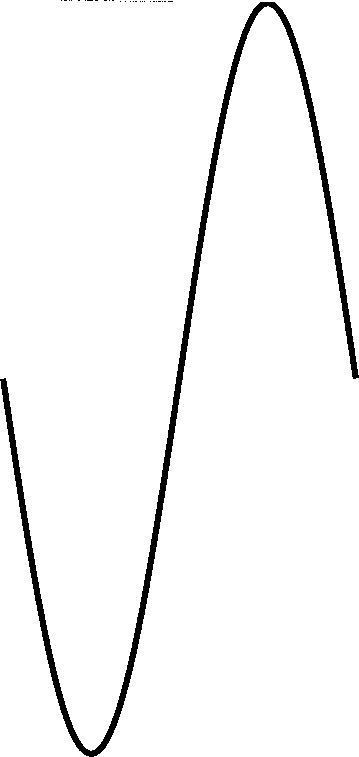
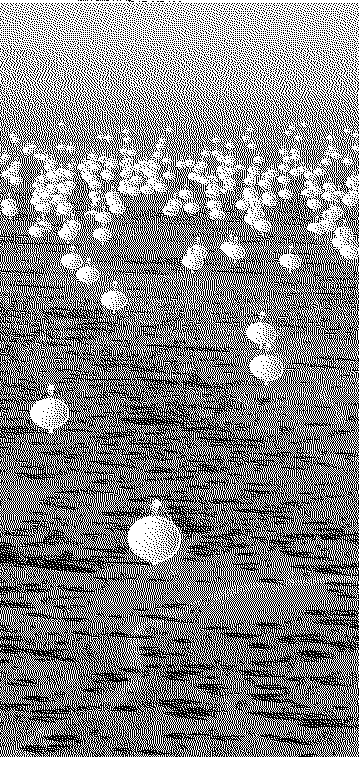
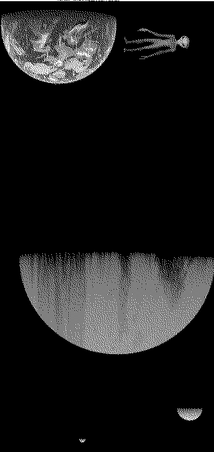

# Worksheet

Command used to split the message in blocks of 359*757=271763 characters:

    split -b 271763 -d SETI_message.txt page

The source is a star about 50 light years from Earth. 
The pulses are in the form of short/long signals and they are received in a very narrow band around an electromagnetic frequency of 452.12919 MHz.

1. What is the typical body height of our interstellar counterparts?
2. What is their typical lifetime?
3. What is the scale of the devices they used to submit their message?
4. Since when have they been communicating interstellar?
5. What kind of object do they live on?
6. How old is their stellar system?


7 binary images 359x757

    F = 452.12919 MHz     = 452.12919_10^6 Hz    = 1420.4057 MHz / PI = Fh / Pi
    L = 66.30681285753 cm = 0.6630681285753 m    =   21.106 cm * PI   = Lh * Pi
    T = 2.212 ns          = 2.212_10^-9 s
   

        
_______________________________________________________________________________
## page00
    image shape (first row and last column is 1) -> calibration frame ?
    

    
_______________________________________________________________________________
## page01
    0, 1, 2, 3, ... 756
    757 first binary values (LSB first)
    10bits
    

    
_______________________________________________________________________________
## page02
    2, 3, 5, 7, 11, 13, 17, 19, 23, ..., 5749
    757 first prime numbers (LSB first)
    13bits
    


    
_______________________________________________________________________________
## page03 - Wave
      
    Wave_0 = 16368191637088910834159098202685440
    Wave_1 = 11677159761321922952849403009790256654968431476473856
    



_______________________________________________________________________________
## page04 - Alien
    
    Alien_0 = 60479561273104168652304174731493376
    Alien_1 = 42037775140758923161949049149211273119409177427443712
    

_______________________________________________________________________________
## page05 - Antennas

    Antennas_0 = 2468553521351190513386359178720371015680
    Antennas_1 = 2335431952264384665006648365913340213606881670994067456



_______________________________________________________________________________
## page06 - Planets

    Planets_0 = 948909505053876287754040784031183263414353920
    Planets_1 = 1401259171358630776572575392119740616658474880694279974420480
        



_______________________________________________________________________________
_______________________________________________________________________________

```
Wave_0     = 2^61      * 5                                * 233 * 239                                                                 * 25494537587
Wave_1     = 2^120                  * 23            * 163             * 307                                     * 41243               * 185069
Alien_0    = 2^65          * 7                                                            * 5821        * 16883                       * 2382943
Alien_1    = 2^122                                                                                                                    * 7906426751855953
Antennas_0 = 2^78  * 3 * 5                                                  * 1031               * 6521                               * 80991373
Antennas_1 = 2^129 * 3         * 13      * 47                                                                                         * 1872127023061
Planets_0  = 2^97  * 3 * 5                    * 139                                                                                   * 2872163495941
Planets_1  = 2^149     * 5                                                         * 2087                               * 134837      * 1395557

Wave_0     = 2^61 * 7098571573036345
Wave_1     = 2^61 * 5064160792674217318972471669424128
Alien_0    = 2^61 * 26228828689307888
Alien_1    = 2^61 * 18230978853627182578885198931296256
Antennas_0 = 2^61 * 1070564436298281123840
Antennas_1 = 2^61 * 1012832158534843496076296462876540928
Planets_0  = 2^61 * 411523898748622968151080960
Planets_1  = 2^61 * 607699295120906087917702923014455416586240


Wave_0  = 2^61 * 7098571573036345 aL = 0.6630681285753 m = 0.2110611405389 * Pi m
        = 16368191637088910834159098202685440 aL
        
1 aL = 4.051_10^-35       m
     = 1.289_10^-35 * Pi  m
     = 2.506        * Planck Length
     = 0.7976 * Pi  * Planck Length
     = sqrt(2 * Pi) * Planck Length
     

____________________________________________________________________________
____________________________________________________________________________

     
-- Dimensions : Number of periods * wave length --
    Wave_1 / Wave_0 =     7.134_10^17 * L =              50 ly
   Alien_0 / Wave_0 =           3.695 * L =           2.450 m              2.45 m   Typical alien height 
Antennas_0 / Wave_0 =      150814.065 * L =      100000.000 m               100 km  Antenna size 
 Planets_0 / Wave_0 = 57972775862.651 * L = 38439899999.563 m           3843990 km  Distance from their star ?
 
-- Time spans : Number of periods / wave frequency --
   Alien_1 / Wave_0 = 2.568_10^18 / F = 5.680_10^9  s = 180.1 years       180.1 y   Typical alien lifespan
Antennas_1 / Wave_0 = 1.427_10^20 / F = 3.156_10^11 s = 10000 years       10000 y   Duration of the emission
 Planets_1 / Wave_0 = 8.561_10^25 / F = 1.893_10^17 s = 6_10^9 years          6 By  Age of their star system

   Alien_1 / Alien_0    = 6.951_10^17
Antennas_1 / Antennas_0 = 9.491_10^14
 Planets_1 / Planets_0  = 1.477_10^15
   Alien_1 / Wave_1     =         3.6
Antennas_1 / Wave_1     =       200
 Planets_1 / Wave_1     = 120000000
 
```

| Variable     | Description | Unit |
|--------------|-------------|------|
| `C`          | Light speed                                     | m / s
| `F`          | Message broadcast frequency                     | oscil / s (Hz)
| `L`          | Wavelength (`L = C / F`)                        | m / oscil
| `T`          | Message broadcast period                        | s / oscil
|||
| `aC`         | Light speed in alien units                      | aL / aT
| `aF`         | Message broadcast frequency in alien units      | oscil / aT
| `aL`         | Wavelength (`aL = aC / aF`)                     | aL / oscil
|||
| `Wave_0`     | Message broadcast wavelength in alien unit of length                              | aL / oscil      
| `Wave_1`     | Distance from Earth in alien unit of length                                       | aL
| `Alien_0`    | Typical alien height in alien unit of length                                      | aL
| `Alien_1`    | Typical alien lifespan as the distance travelled by the light during this time    | aL
| `Antennas_0` | Antenna size in alien unit of length                                              | aL
| `Antennas_1` | Duration of the emission  as the distance travelled by the light during this time | aL
| `Planets_0`  | Distance from their star / Size of their system in alien unit of length           | aL
| `Planets_1`  | Age of their star system as the distance travelled by the light during this time  | aL
